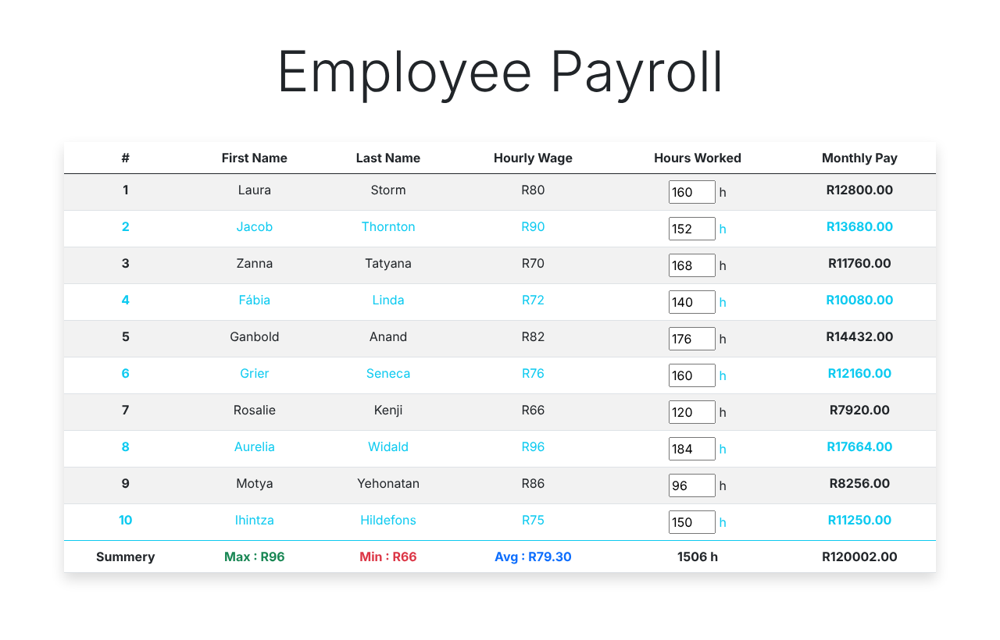

# Payroll Web App

A comprehensive web application for managing employee payroll, salaries, and related financial data.

<p align="center"></p>
<p align="center"><sub>Hours entered for each employee; monthly pay and totals calculate on Enter</sub></p>

## 📋 Overview

A feature-rich payroll management system designed to simplify employee salary calculations, deductions, and payment processing.

## 💼 Features

- **Employee Management** – Add and manage employee records
- **Salary Calculations** – Automated payroll computation
- **Deductions** – Taxes, insurance, benefits
- **Pay Slips** – Generate and view pay statements
- **Reports** – Payroll summary and analytics
- **User Authentication** – Secure login system
- **Dashboard** – Overview of payroll data

## 🛠️ Technologies Used

- **JavaScript** – Frontend logic
- **HTML5** – Markup
- **CSS3** – Styling
- **Backend Framework** – Node.js/Express (if applicable)
- **Database** – MongoDB/SQL (if applicable)

## 🚀 Getting Started

### Prerequisites
- Node.js and npm installed

### Installation

```bash
# Clone the repository
git clone https://github.com/Scarface96/payroll-web-app.git
cd payroll-web-app

# Install dependencies
npm install
```

### Running the App

```bash
npm start
```

The app will open at `http://localhost:3000` or as configured

## 📖 How to Use

1. **Login** – Sign in with credentials
2. **Add Employees** – Create employee records
3. **Input Salaries** – Enter salary information
4. **Calculate Payroll** – Generate payroll
5. **Generate Reports** – View payroll summaries
6. **Export** – Download pay slips and reports

## 📊 Main Sections

- **Dashboard** – Overview and quick stats
- **Employees** – Employee database
- **Payroll** – Salary processing
- **Reports** – Analytics and summaries
- **Settings** – Configuration options

## 📝 License

This project is open source and available under the MIT License.

---

Built with ❤️ by [Scarface96](https://github.com/Scarface96)